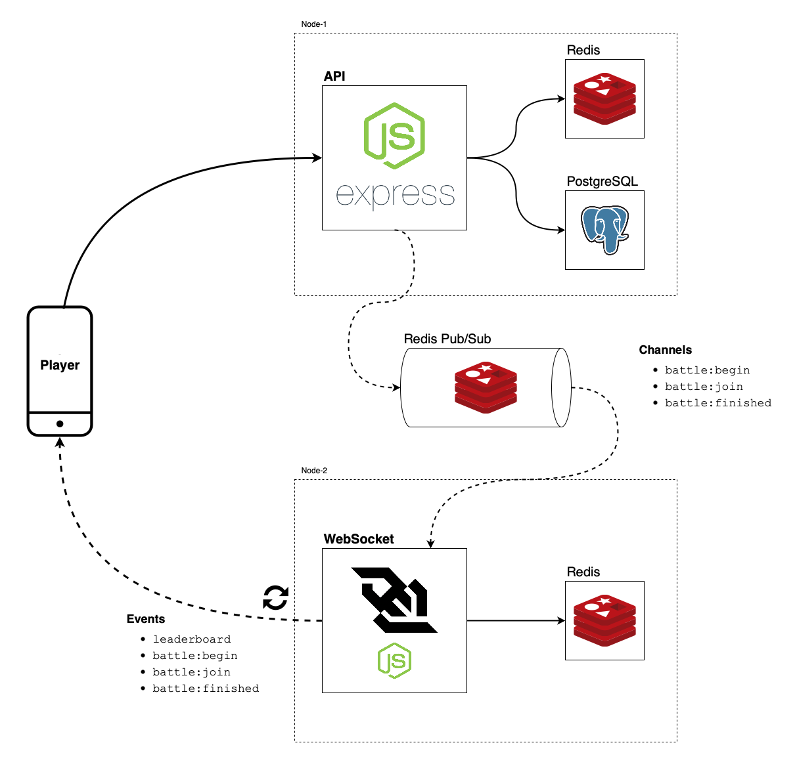

# Architecture

The system is designed to support a real-time multiplayer social game using **Node.js**, **Express**, **WebSocket**, **PostgreSQL**, and **Redis**.\
It follows a modular architecture that separates the responsibilities of API handling, data persistence, real-time communication, and message distribution.

## Components

### Player
- Represents the end-user connecting through a mobile or web client.
- Interacts with the system in two ways:
  - **API Requests** via HTTP (e.g., create player, group, joining a battle, querying leaderboard).
  - **WebSocket Events** for real-time game updates (e.g., battle events, leaderboard updates).

### Node-1: API Service
- Built with **Node.js + Express**.
- Responsible for:
  - Handling client HTTP requests.
  - Validating and processing game logic.
  - Persisting data to **PostgreSQL** (e.g., players, battles, leaderboards).
  - Publishing messages to **Redis Pub/Sub** for event propagation.
- Uses **Redis (key-value store, sets, sorted sets)** for caching and session/state management.

### Node-2: WebSocket Service
- Built with **Node.js** and WebSocket libraries.
- Subscribes to **Redis Pub/Sub** channels to receive game events.
- Pushes real-time updates to connected players, ensuring low-latency communication.
- Publishes/consumes data from **Redis** for state synchronization across nodes.

### PostgreSQL
- Relational database for persistent storage.

### Redis
- Serves dual purposes:
  1. **Caching / Session store**: Low-latency access for API service.
  2. **Pub/Sub messaging**: Facilitates communication between API and WebSocket services.

### Redis Pub/Sub Channels
- Used to broadcast game events between services.
- Example channels:
  - `battle:begin`
  - `battle:join`
  - `battle:finished`

### Events
- Delivered to players through WebSocket:
  - `leaderboard`
  - `battle:begin`
  - `battle:join`
  - `battle:finished`

## Key Benefits

- **Scalability** — API and WebSocket nodes can scale independently.  
- **Low latency** — Redis Pub/Sub provides fast event distribution.  
- **Consistency** — PostgreSQL guarantees reliable persistence for critical game data.  
- **Fault tolerance** — Redis ensures messages are distributed across nodes even under load.  

## Trade-offs & Disadvantages

- **Eventual consistency** — Pub/Sub can introduce race conditions; not all nodes see events at the exact same time.  
- **Message loss risk** — Pub/Sub is fire-and-forget; offline subscribers may miss events.  
- **WebSocket scale complexity** — Managing millions of concurrent sockets requires advanced load balancing.  
- **Operational overhead** — Multiple services (API, WS, Redis, Postgres) increase infrastructure complexity.  
- **Single-DB contention** — Heavy writes to Postgres can become a bottleneck without sharding/replication.  

## Scaling to 1M Users

### Potential Bottlenecks
- WebSocket connection limits (file descriptors, memory, bandwidth).  
- Redis Pub/Sub throughput under high fan-out.  
- Postgres write throughput and query latency.  
- Network load balancing for long-lived connections.  

### Short Term (10k–50k concurrent users)
- **Vertical scaling** — Increase CPU/RAM for API and WebSocket servers to handle more load.
- **Read replicas** — Offload read-heavy queries from PostgreSQL to replicas, reducing main DB pressure.
- **Sticky sessions** — Ensure WebSocket connections remain tied to the same server, simplifying state management.

### Medium Term (50k–200k concurrent users)
- **Horizontal WebSocket scaling** — Distribute player connections across multiple WebSocket servers.
- **Redis Cluster** — Scale Redis horizontally for Pub/Sub and caching to avoid single-node bottlenecks.
- **Durable queues (Kafka / Redis Streams)** — Add message durability and backpressure handling for large-scale events.

### Long Term (200k+ concurrent / 1M users)
- **Multi-region clusters** — Deploy infrastructure across regions for global coverage and lower latency.
- **Sharded database** — Split PostgreSQL into shards (by player ID, group ID, etc.) to handle massive writes and queries.
- **Event streaming backbone** — Use Kafka or Pulsar as the backbone for real-time events, analytics, and replayability.
- **Stateless WebSocket nodes** — Fully externalize state (to Redis/DB) so WS servers can autoscale seamlessly.

## Telegram Integration

- Introduce a **Telegram Worker Service**:  
  - Receives inbound webhooks from Telegram.  
  - Sends outbound messages via Telegram Bot API.  
  - Uses a **durable queue** (Redis Streams / Kafka) for retries and rate-limiting.  
- Benefits:
  - Decouples Telegram from API/WS nodes.  
  - Provides resilience with retries, throttling, and idempotency.  

## Monitoring & Analytics

### Monitoring
- **Prometheus** metrics:
  - Active WebSocket connections.
  - Event loop latency (API + WS).
  - Redis ops/sec, memory, and latency.
  - Postgres queries/sec, slow queries, replica lag.
- **Logging**: structured JSON logs (ELK or Loki).  
- **Tracing**: OpenTelemetry + Jaeger for request flow.  
- **Crash/Error tracking**: Sentry.  

### Dashboards & Alerts
- Grafana dashboards: API latency, WS connections, Redis, DB health.  
- Alerts: error spikes, Redis memory > 80%, DB replication lag > 5s, WS connection load.  

### Product Analytics
- Track events: `battle_started`, `battle_finished`, `leaderboard_view`, etc.  
- Use pipelines (Segment / Kafka → BigQuery/Redshift).  
- Key metrics: DAU/MAU, retention, session length, battles per user, conversion rates.  

## Next Steps

> [!NOTE]
> These items are **not implemented yet** due to time constraints and complexity,  
> but represent clear improvements for scalability, reliability, and observability.

- [ ] Add Prometheus instrumentation.  
- [ ] Add Grafana dashboards for API, WS, DB, Redis.  
- [ ] Add PgBouncer + Postgres read replicas.  
- [ ] Move critical events from Pub/Sub to durable queue.  
- [ ] Deploy Telegram worker for notifications.  
- [ ] Add Sentry + tracing for better observability.  
