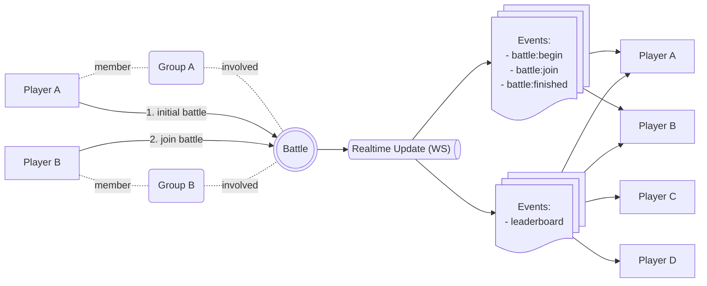

# Testing Guide

This guide explains how to simulate players, groups, and battles, and how to verify
real-time updates through the WebSocket server.

<details open>
<summary>Testing Flow for Battle & Leaderboard Realtime Updates</summary>

## Testing Flow for Battle & Leaderboard Reatime Updates



This test simulates a scenario with four players:
- **Player A** (Group A)
- **Player B** (Group B)
- **Player C** (not involved in battle, just observing leaderboard)
- **Player D** (not involved in battle, just observing leaderboard)

</details>

> [!NOTE]
> All players (A, B, C, D) and groups (A, B) used in this simulation are already inserted into the database as mock data.\
> No additional setup is required.

## Instructions

### 1. Run API and WebSocket Server

```
npm run dev
```

### 2. Connect All Players via WebSocket

Simulate all four players by connecting them to the WebSocket server:

```
npm run client:ws 11111111-1111-1111-1111-111111111111
npm run client:ws 22222222-2222-2222-2222-222222222222
npm run client:ws 33333333-3333-3333-3333-333333333333
npm run client:ws 44444444-4444-4444-4444-444444444444
```

- **Player A** and **Player B** → will actively participate in the battle.
- **Player C** and **Player D** → will only observe leaderboard updates.

### 3. Run the Battle Test

Execute the automated test script to simulate the full battle flow:

```
npm run integration:battle
```

This will perform the following sequence:
1. **Player A** creates a battle:
   - Group A vs Group B.
2. **Player B** joins the battle:
   - Triggers `battle:join` event.
3. **Player A** begins the battle:
   - Battle officially starts.
   - Triggers `battle:begin` event.
4. **Player A** finishes the battle:
   - A random winner and score are generated.
   - Triggers `battle:finished` event.
   - Triggers `leaderboard` event.

### 4. Verify Realtime Updates
- **Player A** → receives all battle events + `leaderboard`.
- **Player B** → receives all battle events + `leaderboard`.\
- **Player C** → only receives `leaderboard`.
- **Player D** → only receives `leaderboard`.
