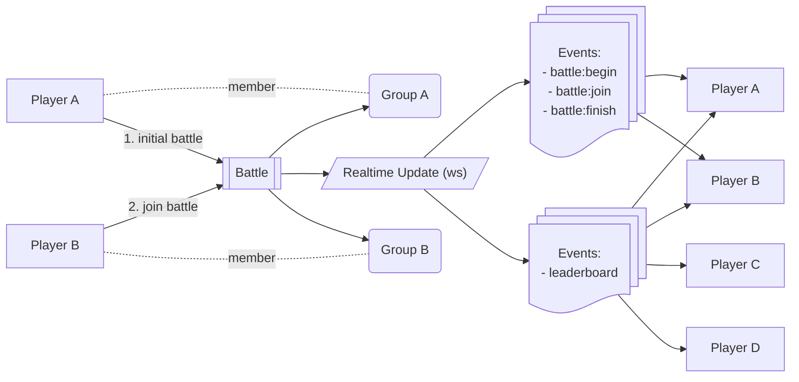

# Testing Guide

This guide explains how to simulate players, groups, and battles, and how to verify
real-time updates through the WebSocket server.

Testing Flow

## Testing Flow

```mermaid
flowchart LR
    A[Player A] -. member .- GA(Group A)
    A -->|1. initial battle| B1[[Battle]]
    B -->|2. join battle| B1[[Battle]]
    B[Player B] -. member .- GB(Group B)
    B1 --> GA
    B1 --> WS@{ shape: lean-r, label: Realtime Update (ws) }
    B1 --> GB
    WS --> EV1@{ shape: docs, label: "Events:
    - battle:begin
    - battle:join
    - battle:finish" }
    WS --> EV2@{ shape: docs, label: "Events:
    - leaderboard" }
    EV1 --> X1[Player A]
    EV1 --> X2[Player B]
    EV2 --> X1
    EV2 --> X2
    EV2 --> X3[Player C]
    EV2 --> X4[Player D]
```

